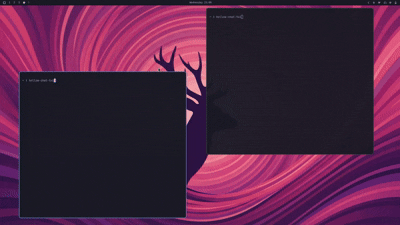

<div align="center">

# Hollow Chat TUI

A colorful terminal chat app with rooms. Self hosted server, cross platform TUI client built with .NET and Terminal.Gui.




</div>

## Features

* Public rooms (join by name) and private rooms (join with a code)
* Server side routing, so you only receive messages from your own room
* Themed terminal UI with a scrollable message history
* Single file client, no runtime to install

## Quick start

Download the client for your platform from the [latest release](https://github.com/Nick-Lemy/hollow-chat-tui/releases/latest), then run it:

```bash
tar -xzf hollow-chat-tui-linux-x64.tar.gz
./hollow-chat
```

On first launch it asks for your name and a server address. Point it at any Hollow Chat server (see below).

## Host your own server

The client is useless without a server, and anyone can run one. It speaks raw TCP on port `11000`.

With Docker:

```bash
git clone https://github.com/Nick-Lemy/hollow-chat-tui.git
cd hollow-chat-tui
docker build -t hollow-chat-server .
docker run -d --name hollow-chat --restart unless-stopped -p 11000:11000 hollow-chat-server
```

Then share your machine's IP. Clients connect by entering `your-ip:11000` at the address prompt. Open port `11000` in your firewall (and your cloud provider's firewall if you use one).

## Build from source

Requires the .NET 10 SDK.

```bash
dotnet run --project server   # start a local server
dotnet run --project client   # start the client
```

## Status

This is a prototype. Rooms live in memory only, there is no persistence or authentication yet, and the transport is plain TCP. Expect rough edges.
